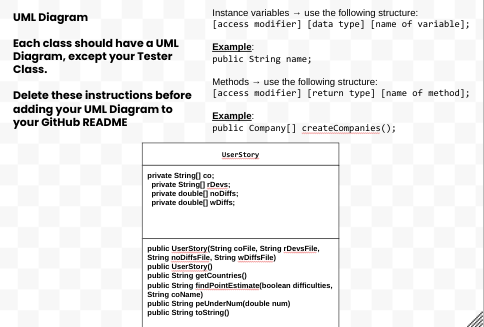

# Unit 3 - Data for Social Good Project - Teya and Emily

## Introduction 

Software engineers develop programs to work with data and provide information to a user. Each user has different needs based on the information they are looking for from data. Your goal is to create a data analysis program for your user that stores and analyzes data to provide the information they need. 

## Requirements 

Use your knowledge of object-oriented programming, one-dimensional (1D) arrays, and algorithms to create your data analysis program: 
- **Write a class** – Write a class to represent your user or business and store and analyze their data with no-argument and parameterized constructors. 
- **Create at least two 1D arrays** – Create at least two 1D arrays to store the data that your user needs information about. 
- **Write a method** – Write a method that finds or manipulates the elements in a 1D array to provide the information your user needs. 
- **Implement a toString() method** – Write a toString() method that returns general information about the data (for example, number of values in the dataset). 
- **Document your code** – Use comments to explain the purpose of the methods and code segments and note any preconditions and postconditions. 

## User Story 

Include your User Story you analyzed for your project here. Your User Story should have the following format: 

> As an [English teacher],   
> I want to [analyze and identify students' reading proficiency rates in underdeveloped countries],   
> so that I can [travel to and support the countries that need the most help]. 

## Dataset 

Include a hyperlink to the source of your dataset used for this project. Additionally, provide a short description of each column used from the dataset, and the data type. 

Dataset: https://data.unicef.org/resources/education-for-children-with-disabilities/global-co2-emissions 
- **Country** (String) - name of the country 
- **Region Development** (String) - how developed the country is
- **Children w/o Funcitonal Difficulties** (double) - percentage point estimate of children without functional difficulties 
- **Children w/ Funcitonal Difficulties** (double) - percentage point estimate of children with functional difficulties

## UML Diagram 

Put and image of your UML Diagram here. Upload the image of your UML Diagram to your repository, then use the Markdown syntax to insert your image here. Make sure your image file name is one work, otherwise it might not properly get display on this README. 

 

## Description 

Our Social Good Project contains **1-D Arrays** that, through the paramaterized constructor, was created with multiple **text files**. We used 1 regular accessor method, and 2 additional methods that accessed a specific **element(s)**. We did this by **traversing** by increasing the **loop control variable** by **increments** the countries list and using the desired country's **index** to access the desired element. We were also able to overcome an **off-by-one error** in order to add our to String as well, which prints all values in an organized manner.